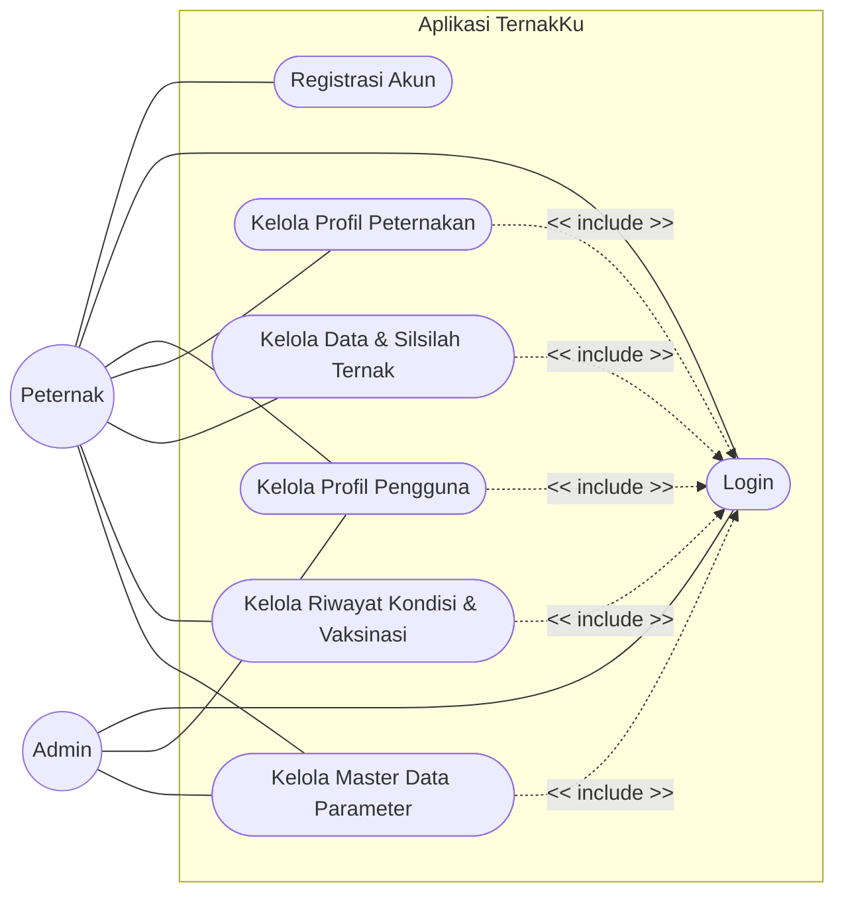
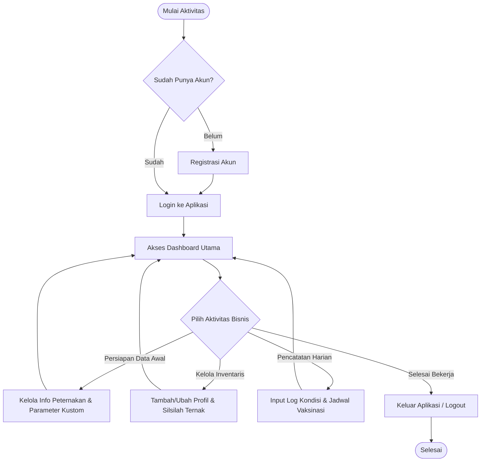

  

---

## 📖 Deskripsi

**TernakKu** adalah aplikasi sistem informasi manajemen berbasis digital yang dirancang untuk membantu peternak dalam mengelola aktivitas operasional peternakan secara lebih mudah, cepat, dan terstruktur.

Aplikasi ini menggantikan proses pencatatan manual menjadi sistem pencatatan digital yang terintegrasi. Melalui TernakKu, peternak dapat mengelola profil peternakan, mencatat data inventaris dan silsilah genetika ternak, serta memantau riwayat setiap individu hewan secara real-time. Fitur pencatatan mencakup kejadian umum (kelahiran, sakit, kematian) hingga rekam medis khusus seperti penjadwalan dan pelacakan riwayat vaksinasi.

Dengan digitalisasi pencatatan tersebut, TernakKu diharapkan mampu meningkatkan efisiensi operasional, menjaga akurasi data, serta membantu meningkatkan produktivitas usaha peternakan.

---

## 🎯 Tujuan Pengembangan

TernakKu dikembangkan untuk membantu peternak dalam:

- Melakukan digitalisasi pencatatan operasional peternakan secara terpusat.
- Mengurangi kesalahan pencatatan manual terkait rekam jejak dan silsilah ternak.
- Mempermudah pemantauan kondisi harian dan penjadwalan vaksinasi hewan.
- Menyediakan arsitektur data kustom yang fleksibel (peternak dapat membuat kategori pencatatan sendiri).
- Meningkatkan efisiensi pengelolaan usaha peternakan secara keseluruhan.

## 📌 Use Case

1. **UC1: Registrasi Akun**: Peternak mendaftarkan diri jika belum memiliki akun.

2. **UC2: Login**: Akses masuk ke dalam sistem menggunakan kredensial yang sudah didaftarkan, berlaku untuk Peternak dan Admin sesuai role masing-masing.

3. **UC3: Kelola Profil Pengguna**: Memperbarui informasi personal pengguna (Peternak/Admin).

4. **UC4: Kelola Profil Peternakan**: Peternak melengkapi dan memperbarui informasi dasar mengenai lokasi dan identitas peternakan yang dikelolanya.

5. **UC5: Kelola Data & Silsilah Ternak**: Peternak melihat daftar inventaris, menambah/mengubah profil individu hewan, serta mendata garis keturunan (induk dan pejantan).

6. **UC6: Kelola Riwayat Kondisi & Vaksinasi**: Peternak mencatat buku log harian (kejadian lahir, sakit, dll) serta mengatur jadwal dan rekam medis vaksinasi secara spesifik.

7. **UC7: Kelola Master Data Parameter**: Admin bertugas mengelola parameter global (tipe hewan, kondisi, dan jenis vaksin bawaan sistem). Peternak juga memiliki akses ke modul ini untuk membuat parameter kustom yang khusus berlaku di peternakannya sendiri.

---

## ⚙️ Activity Diagram

1. **Titik Masuk (Autentikasi)**: Peternak memulai dengan mengecek apakah sudah memiliki akun. Jika belum, peternak melakukan registrasi terlebih dahulu, kemudian login ke dalam sistem.

2. **Pusat Kendali (Dashboard)**: Setelah berhasil login, peternak diarahkan ke Dashboard sebagai pusat kendali untuk memilih aktivitas operasional.

3. **Tiga Pilar Aktivitas Bisnis:**
    - **Persiapan Data Awal**: Dilakukan saat pertama kali setup aplikasi. Peternak mendaftarkan lokasi peternakan dan dapat mendefinisikan tipe parameter kustom (seperti jenis kondisi atau vaksin khusus) jika template bawaan dari sistem kurang memadai.
    - **Manajemen Inventaris**: Dilakukan ketika ada penambahan ternak baru, pembaruan identitas visual hewan, atau menautkan data silsilah (induk/pejantan) ke dalam sistem.
    - **Pencatatan Harian**: Aktivitas operasional rutin. Peternak mencatat kondisi ternak secara aktual serta melakukan tracking rekam medis (seperti mencatat nomor batch vaksin dan menjadwalkan vaksinasi berikutnya).

4. **Siklus Berulang**: etelah menyelesaikan satu tugas, peternak kembali ke Dashboard untuk melanjutkan tugas lain atau memilih keluar (logout) jika seluruh pekerjaan selesai.

## 🗄️ Entity Relationship Diagram (ERD)

1. **Autentikasi & Hak Akses (`users`, `roles`)**
    - **Fitur Registrasi & Login**: Diakomodasi penuh dalam tabel `users` melalui atribut kredensial (`email`, `password`). Alur keamanan dan validasi menggunakan atribut `otp_code`, `otp_expiration`, dan `is_verified`.
    - **Pemisahan Wewenang**: Atribut `role_id` pada tabel pengguna terhubung ke tabel referensi `roles`, berfungsi membedakan antarmuka dan hak akses antara Admin (pengelola sistem) dan Peternak (pengguna akhir).

2. **Manajemen Profil Peternakan (`farms`)**
    - **Kepemilikan Tunggal**: Atribut `user_id` pada tabel `farms` menggunakan *constraint* `[unique, not null]` sehingga satu pengguna hanya dapat mengelola satu peternakan.

    - **Pemetaan Lokasi**: Fitur peta spasial (Google Maps/Leaflet) didukung oleh atribut `latitude` dan `longitude`.

3. **Inventaris & Silsilah Ternak (`livestocks`)**
    - **Identifikasi Fleksibel**: Melalui atribut `tag_id`, `name`, dan `picture`, aplikasi tetap relevan bagi peternak berskala kecil yang mengidentifikasi hewan menggunakan nama/ciri fisik maupun peternak besar yang menggunakan nomor anting (*ear tag*).
    - **Pelacakan Garis Keturunan**: Fitur silsilah atau genetika diimplementasikan dengan atribut `father_id` dan `mother_id` yang merujuk kembali ke ID utama di tabel `livestocks` yang sama.

4. **Arsitektur Master Data Dinamis (`animal_types`, `condition_types`, `vaccines`)**
    - **Pola Desain Template**: Jika `farm_id` bernilai `null`, maka data tersebut berfungsi sebagai template global bawaan yang dibuat oleh Admin. Jika `farm_id` terisi, maka itu adalah kategori kustom yang dibuat mandiri oleh suatu peternakan.
    - **Integritas Kode Data**: Implementasi *Composite Unique Key* pada blok *indexes* `{ (code, farm_id) [unique] }` memastikan peternak bebas membuat kode (`code`) kustom tanpa memicu bentrok dengan kode dari peternak lain, namun tetap mempertahankan keunikan di dalam peternakannya sendiri.

5. **Pencatatan Operasional Harian (`condition_histories`, `vaccination_histories`)**
    - **Kondisi Umum (`condition_histories`)**: Berfungsi sebagai *logbook*. Menghubungkan hewan terkait (`livestock_id`) dengan kejadian spesifik (`condition_type_id`) berdasarkan tanggal kejadian aktual (`record_date`) dan dilengkapi catatan tambahan (`notes`).
    - **Rekam Medis Khusus (`vaccination_histories`)**: Dipisahkan dari tabel kondisi umum untuk melacak atribut medis khusus, seperti `batch_number`. Peternak dapat melacak nomor seri vaksin tertentu yang disuntikkan jika sewaktu-waktu terjadi wabah atau efek samping. Selain itu, peternak dapat menjadwalkan vaksinasi (`vaccination_date`) dan menandai status apakah sudah divaksinasi atau belum (`is_vaccinated`).