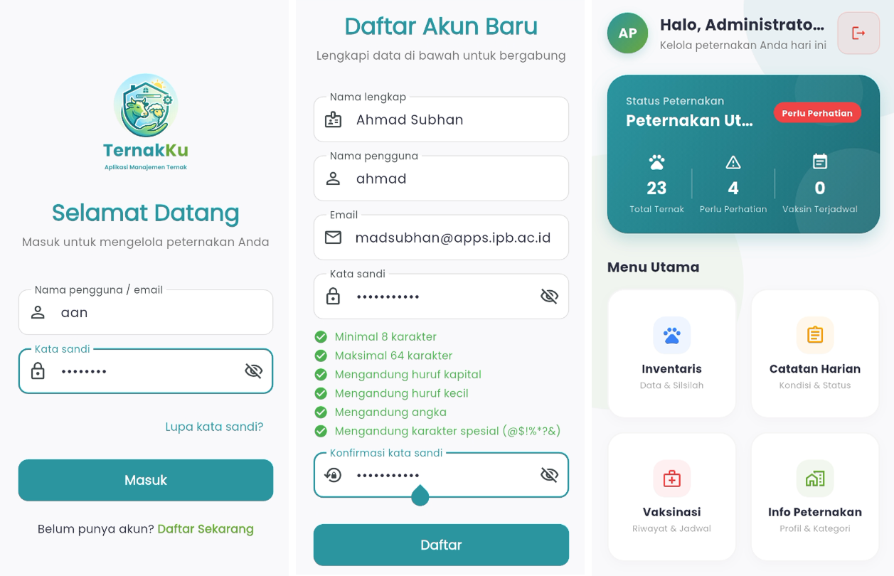
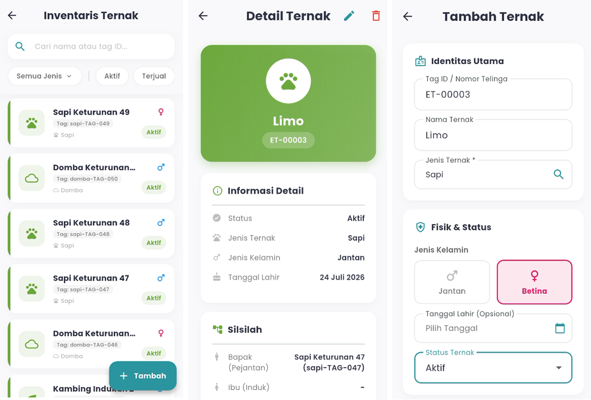
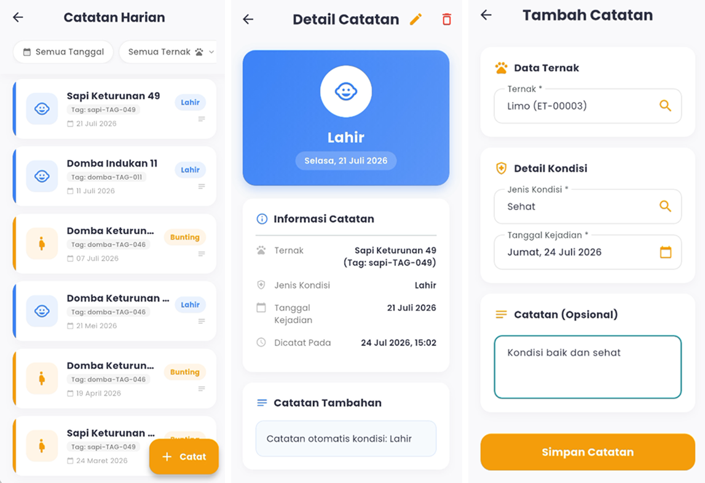
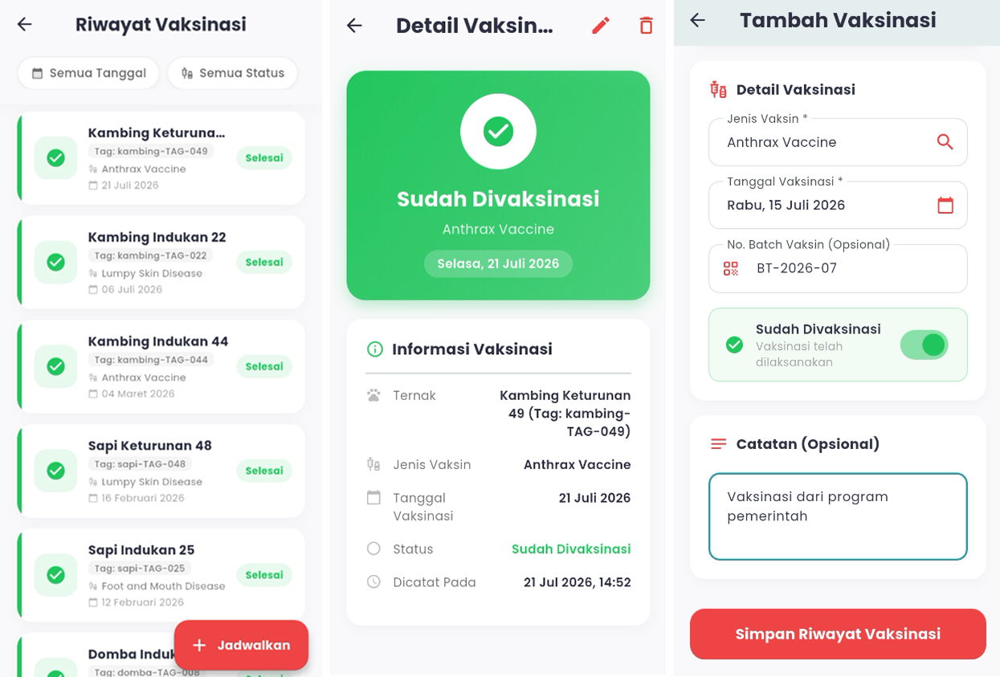

  

---

## 📖 Deskripsi

**TernakKu** adalah aplikasi sistem informasi manajemen berbasis digital yang dirancang untuk membantu peternak dalam mengelola aktivitas operasional peternakan secara lebih mudah, cepat, dan terstruktur.

Aplikasi ini menggantikan proses pencatatan manual menjadi sistem pencatatan digital yang terintegrasi. Melalui TernakKu, peternak dapat mengelola profil peternakan, mencatat data inventaris dan silsilah genetika ternak, serta memantau riwayat setiap individu hewan secara real-time. Fitur pencatatan mencakup kejadian umum (kelahiran, sakit, kematian) hingga rekam medis khusus seperti penjadwalan dan pelacakan riwayat vaksinasi.

Dengan digitalisasi pencatatan tersebut, TernakKu diharapkan mampu meningkatkan efisiensi operasional, menjaga akurasi data, serta membantu meningkatkan produktivitas usaha peternakan.

---

## 🎯 Tujuan Pengembangan

TernakKu dikembangkan untuk membantu peternak dalam:

- Melakukan digitalisasi pencatatan operasional peternakan secara terpusat.
- Mengurangi kesalahan pencatatan manual terkait rekam jejak dan silsilah ternak.
- Mempermudah pemantauan kondisi harian dan penjadwalan vaksinasi hewan.
- Menyediakan arsitektur data kustom yang fleksibel (peternak dapat membuat kategori pencatatan sendiri).
- Meningkatkan efisiensi pengelolaan usaha peternakan secara keseluruhan.

## 📱 Tampilan Aplikasi

### 1. 🏠 Halaman Home

Halaman Home merupakan halaman utama aplikasi yang memberikan ringkasan informasi peternakan dan akses cepat menuju fitur-fitur utama TernakKu.

### 2. 🐄 Inventaris Ternak

Menu Inventaris Ternak digunakan untuk mengelola data individu ternak yang dimiliki oleh peternak. Pengguna dapat melihat daftar ternak beserta informasi penting terkait masing-masing individu.

### 3. 📝 Catatan Harian

Menu Catatan Harian memungkinkan peternak mencatat berbagai kejadian dan aktivitas yang terjadi di peternakan. Pencatatan dapat digunakan untuk mendokumentasikan kondisi maupun kejadian penting yang berkaitan dengan ternak.

### 4. 💉 Riwayat Vaksinasi

Menu Riwayat Vaksinasi digunakan untuk mencatat dan memantau riwayat pemberian vaksin pada ternak. Fitur ini membantu peternak dalam mengetahui vaksinasi yang telah dilakukan serta mempermudah pemantauan jadwal vaksinasi berikutnya.

